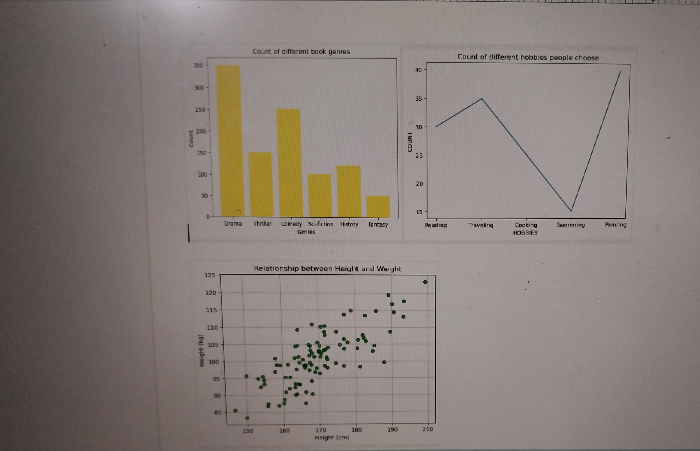
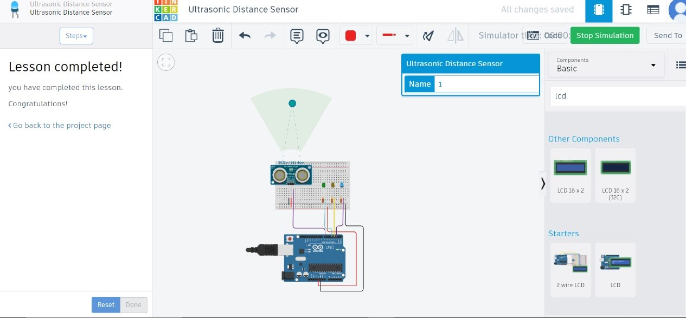
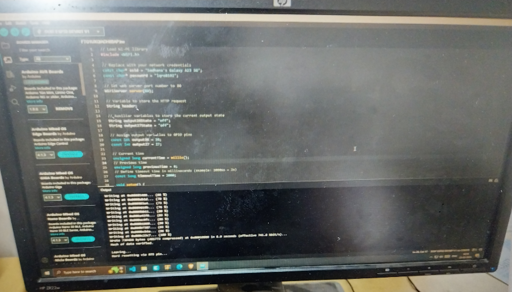
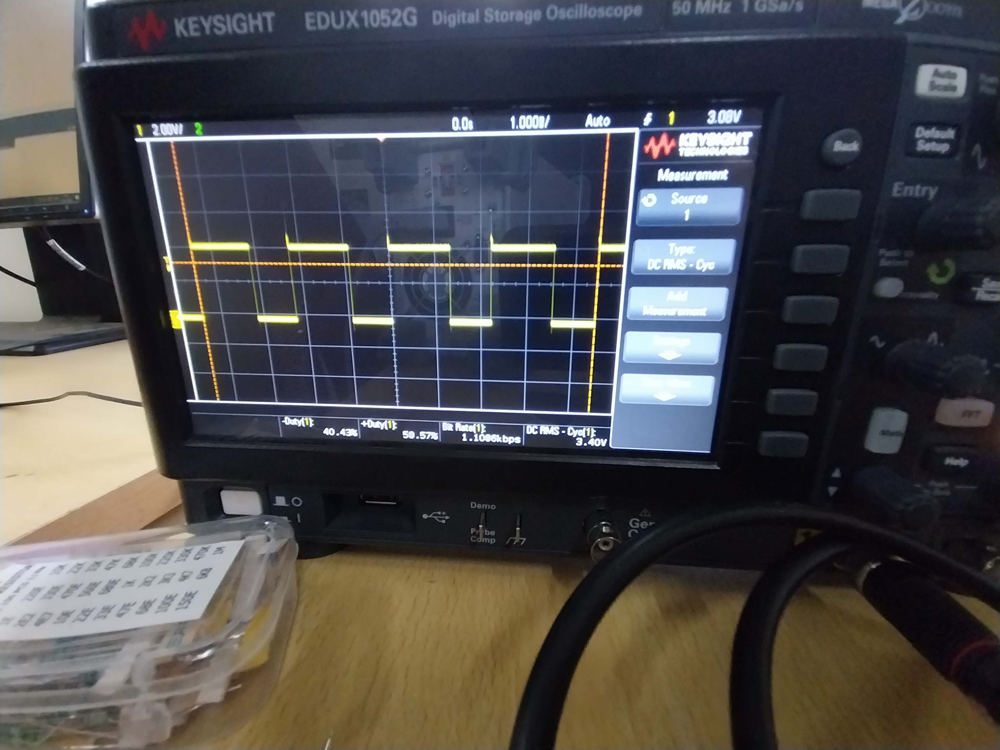
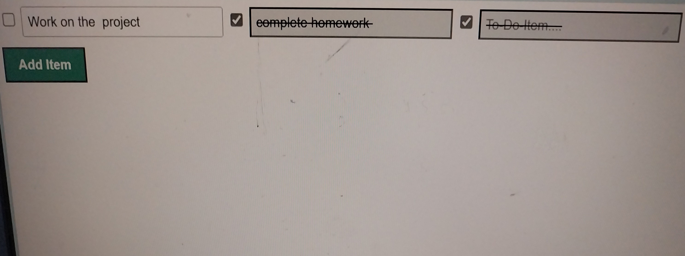
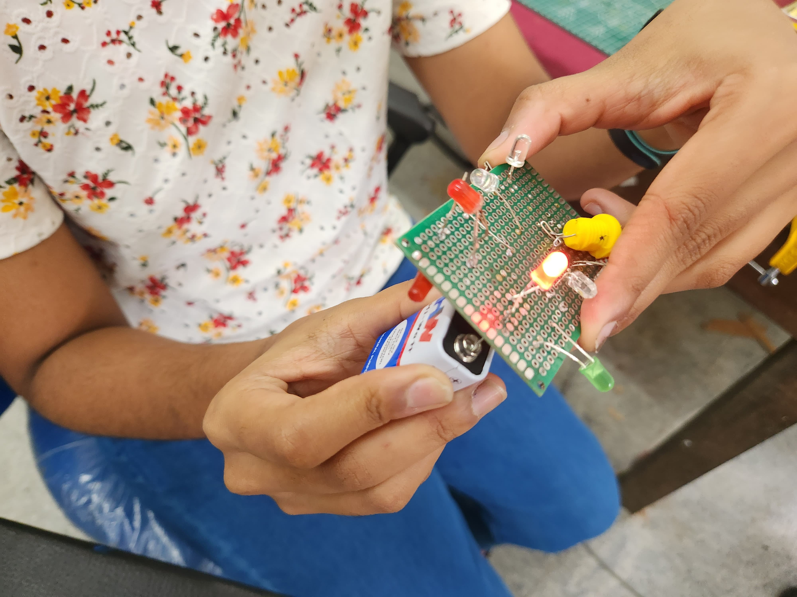

## Task 1: 3-D Printing
A 3D printer operates by melting plastic filament, PLA, and depositing it layer by layer to form a physical object. STL files define the shape of the object using surface geometry. Slicing software such as Ultimaker Cura or Creality slicer prepares the STL file for printing. 3D printer used: Creality CR10 Smart Pro to print a golf tee.

## Task 2: Working with GitHub
I familiarized myself with GitHub Actions, Issues, and pull requests. I explored the provided repository and followed the instructions in the README file. I set up and configured GitHub Actions, managed issues to track tasks and bugs, and created pull requests to make the changes. All necessary tasks were completed in the README.
-1.jpg>)

## Task 3: Get Familiar with the Command Line on Ubuntu and Do the Following Subtasks
I created a folder named `test` and navigated into it. Within this folder, I created a blank file without using any text editor. I then created 2600 folders within the `test` folder. Finally, I concatenated two text files containing random text.

## Task 4: Kaggle Contest
I created a Kaggle account and participated in the Titanic ML competition to gain experience with the platform and machine learning competitions. The challenge involved using machine learning to predict which passengers survived the Titanic shipwreck. This experience helped me understand the workflow of Kaggle competitions and explore ML skills.
-1.jpg>)

## Task 5: Working with Pandas and Matplotlib
Using Pandas and Matplotlib, I created three different graphs from a chosen dataset. For the scatter plot, I visualized the relationship between height and weight. The bar graph represented the count of different book genres. Finally, the line graph illustrated the count of people involved in different hobbies over time.

## Task 6: Tinkercad
I completed the radar system project using Tinkercad. The ultrasonic sensor measured distances, while the servo motor rotated the sensor to cover a wider area. The system was simulated successfully, with accurate distance readings displayed on the serial monitor.

## Task 7: Speed Control of DC Motor
I controlled the speed of a 5V BO motor using an L298N motor driver and an Arduino UNO. The setup was first simulated on Tinkercad and then implemented on hardware. The process was recorded on video to document the successful implementation and control of the motor. This task provided hands-on experience with motor control methods.

## Task 8: LED Toggle using ESP32
I learned the working of an ESP32 microcontroller and created a standalone web server to control the LED. Using the Arduino IDE, I configured the environment to upload code to the ESP32. The web server was developed to allow control of the LED via a web browser interface, enabling the LED to be turned on and off remotely. This project provided hands-on experience with the ESP32.

## Task 9: 555 Oscillator
I designed and built a 555 astable multivibrator circuit with a 60% duty cycle. The waveform displayed on the DSO was close to the expected 60% duty cycle. This project provided valuable hands-on experience in designing and testing electronic circuits.

## Task 10: Portfolio
I have developed a responsive portfolio website showcasing my interests, projects, and social media profiles. This project serves as a comprehensive platform to present my works and connect with viewers effectively. [My Portfolio](https://sadhanathanga)
You can copy and paste this code into your Markdown file.

# Task 11: API
An API (Application Programming Interface) is a set of rules and protocols that allows different software applications to communicate with each other. I explored how APIs function and their various applications.For this , I built a 'TO-DO-LIST' API, where we can keep a track of tasks we are supposed to perform or are already performed.

# Task 12:Soldering
I learned to use various soldering tools in our lab, including solder, a soldering iron, soldering wick, and flux. Using these tools, I performed basic soldering on a perf board, assembling a simple LED circuit under the supervision of a coordinator. 

